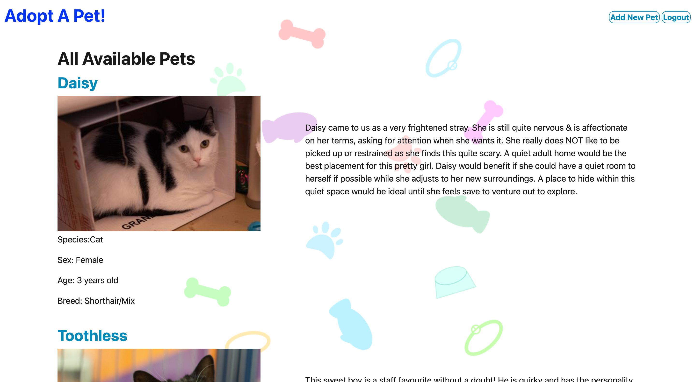
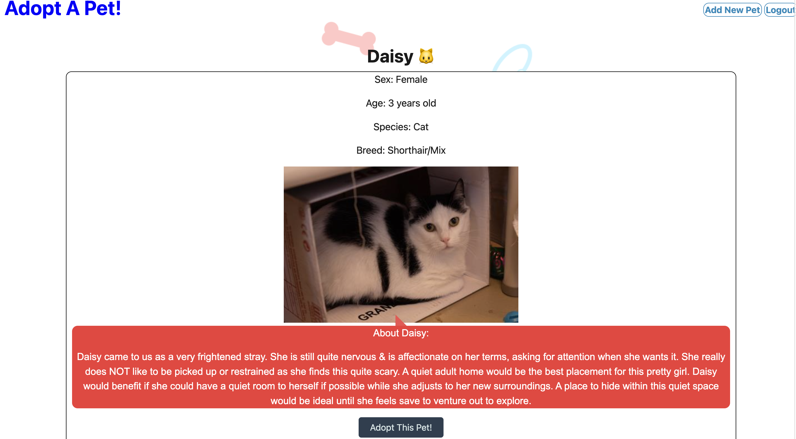

# Project 2: Adoption Site

## Description 

The purpose of this project is to work as a development team to create a pet adoption site that provides information about pets to users. Additionally, the site also allows for users classified as admins to access the database directly from the website in order to add new pets to the selection. We wanted to provide a platform on which pet shelters may use to give users information on pets that are currently available for adoption. 

## Table of Contents

- [Installation](#installation)
- [Usage](#usage)
- [Credits](#credits)
- [License](#license)

## Installation

There is no installation required in order to access the website. The website is fully functional and accessible through the live website: https://petplace2141.herokuapp.com/.

## Usage

The website features a homepage listing all of the currently available animals and lists the names and corresponding images for the pets. The pet details on the homepage and the links to each specific pet's page are only available once the user is logged into their account. The login page is accessed through the login button on the top right of the webpage, where it displays options to either log in or sign up for a new account. The user can log out by clicking on the logout button on the top right of the wepage once logged in. Once signed up or logged in, the homepage will refresh and the corresponding details for each pet will display including its sex, age, species, breed, and a brief description regarding their personality. The name of the pet can be clicked in order to open a page that again displays their information, and an "Adopt Me" button is present for when the user wants to adopt the pet. For admin accounts, there is an option to add a new pet. The page is accessed through the button to the left of the login/logout button, where admins can input information about the new pet. 

Homepage: 

Pet's page:

Login page:

## Credits 

Creators: Favour Adesiyan, Ellison Chen and Sagiri Ikenaga

## License

This project is covered under the license of MIT. For more information about this license, please see: https://opensource.org/licenses/MIT.
