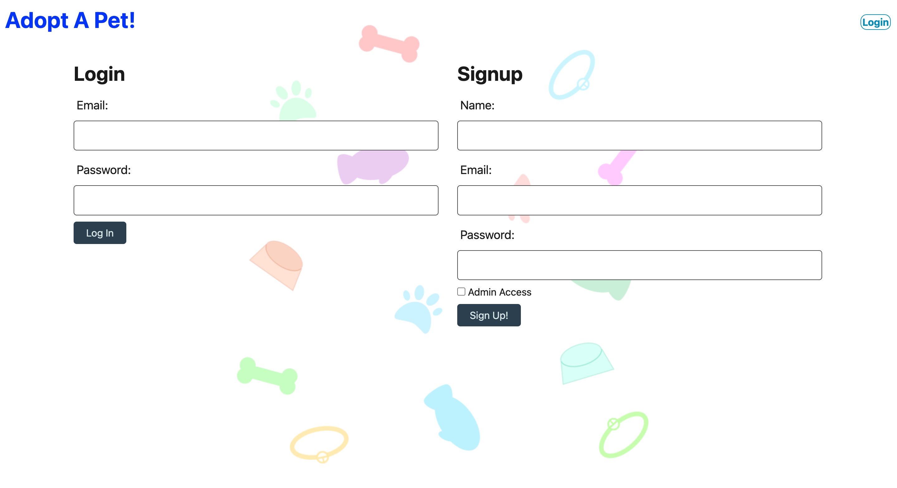

# Adoption-site

This is a pet adoption site which provides information about pets to users

The site also allows for admins to access the database to upload new pets

We wanted to provide a platform on which pet shelters may use to give users information on pets available for adoption

## Table of Contents

- [User story](#User-story)
- [Installation](#installation)
- [Usage](#usage)
- [License](#license)
- [Tests](#tests)

# User story

AS AN administrator
I WANT to be able to add new pets to the database by inputting the required values, name, age, sex, species, and breed, as well as a photo of the pet
SO THAT I can easily add new pets to be adopted
AS A user
I WANT to be able to view the pet’s information once I have logged into my account on the website
SO THAT I can pick the perfect pet to adopt

# Installation

The user should clone the repository from GitHub. This application requires Node.js, Inquirer, console.table and mysql2. To start application run `npm i`then source the sql file then seed index.js then`npm start`. To view database from MySQL `run mysql -u root -p`.

# Usage

(https://adoption-website.herokuapp.com/)

# License

This web application is licensed with MIT
